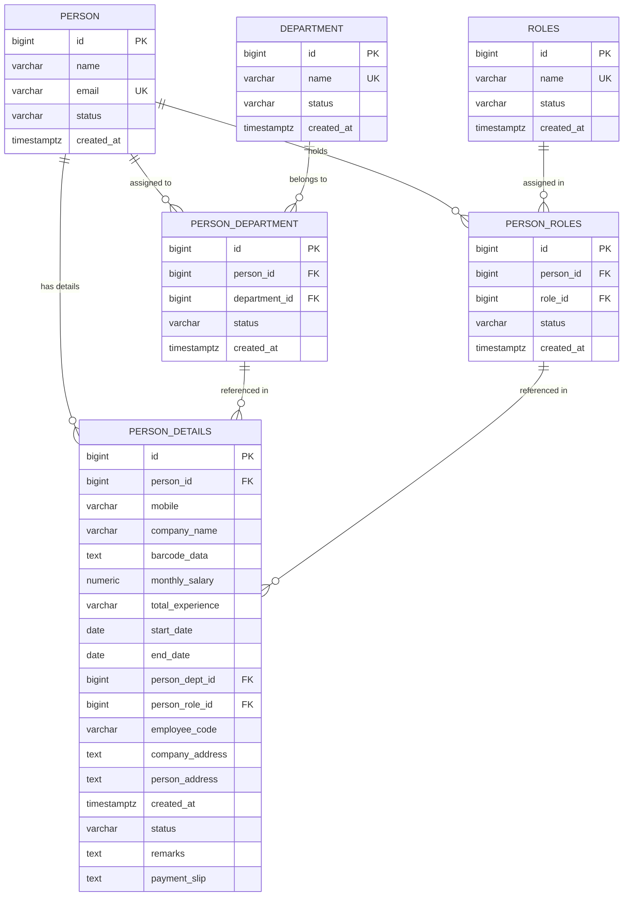

# Background Verification System - PostgreSQL Database Setup

This database schema is designed according to the relational entity-relationship (ER) specifications for the **Background Verification System**, including `person`, `department`, `roles`, `person_department`, `person_roles`, and `person_details`.

---

## 📐 Entity Relationship Diagram (ERD)



---

## 📋 Schema Table Columns

### `person_details` (Verification Details Entity)
| Column | Type | Constraints | Description |
| :--- | :--- | :--- | :--- |
| `id` | `BIGSERIAL` | `PRIMARY KEY` | Auto-increment unique ID |
| `person_id` | `BIGINT` | `FK -> person(id)` | Foreign Key referencing individual |
| `mobile` | `VARCHAR(20)` | `NULLABLE` | Contact phone / mobile number |
| `company_name` | `VARCHAR(150)` | `NULLABLE` | Employer organization name |
| `barcode_data` | `TEXT` | `NULLABLE` | Verification QR/Barcode hash string |
| `monthly_salary` | `NUMERIC(12,2)` | `NULLABLE` | Monthly salary compensation |
| `total_experience` | `VARCHAR(50)` | `NULLABLE` | Tenure duration string (e.g. "2 yrs 5 mos") |
| `start_date` | `DATE` | `NULLABLE` | Employment start date |
| `end_date` | `DATE` | `NULLABLE` | Employment end date (NULL if active) |
| `person_dept_id` | `BIGINT` | `FK -> person_department(id)` | Department junction reference |
| `person_role_id` | `BIGINT` | `FK -> person_roles(id)` | Role junction reference |
| `employee_code` | `VARCHAR(50)` | `NULLABLE` | Organization Employee Code / ID |
| `company_address` | `TEXT` | `NULLABLE` | Company physical location |
| `person_address` | `TEXT` | `NULLABLE` | Residential / permanent address |
| `created_at` | `TIMESTAMPTZ` | `DEFAULT NOW()` | Record creation timestamp |
| `status` | `VARCHAR(50)` | `DEFAULT 'active'` | Verification / record status |
| `remarks` | `TEXT` | `NULLABLE` | Notes, achievements, or details |
| `payment_slip` | `TEXT` | `NULLABLE` | Salary slip document URL / filename |

---

## 🚀 Commands to Manage Database with Prisma

```bash
# Push database schema to PostgreSQL
npm run db:push

# Generate Prisma Client
npm run db:generate

# Seed sample data into PostgreSQL
node prisma/seed.js

# Launch Prisma Studio (Visual DB Inspector)
npm run db:studio
```
